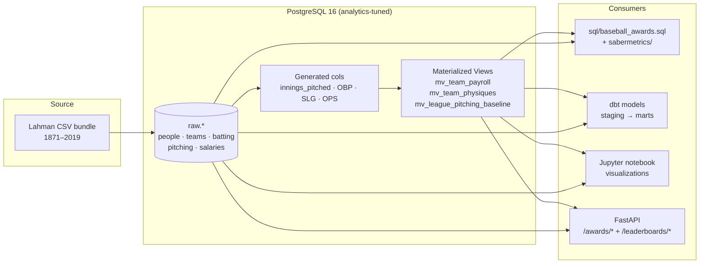
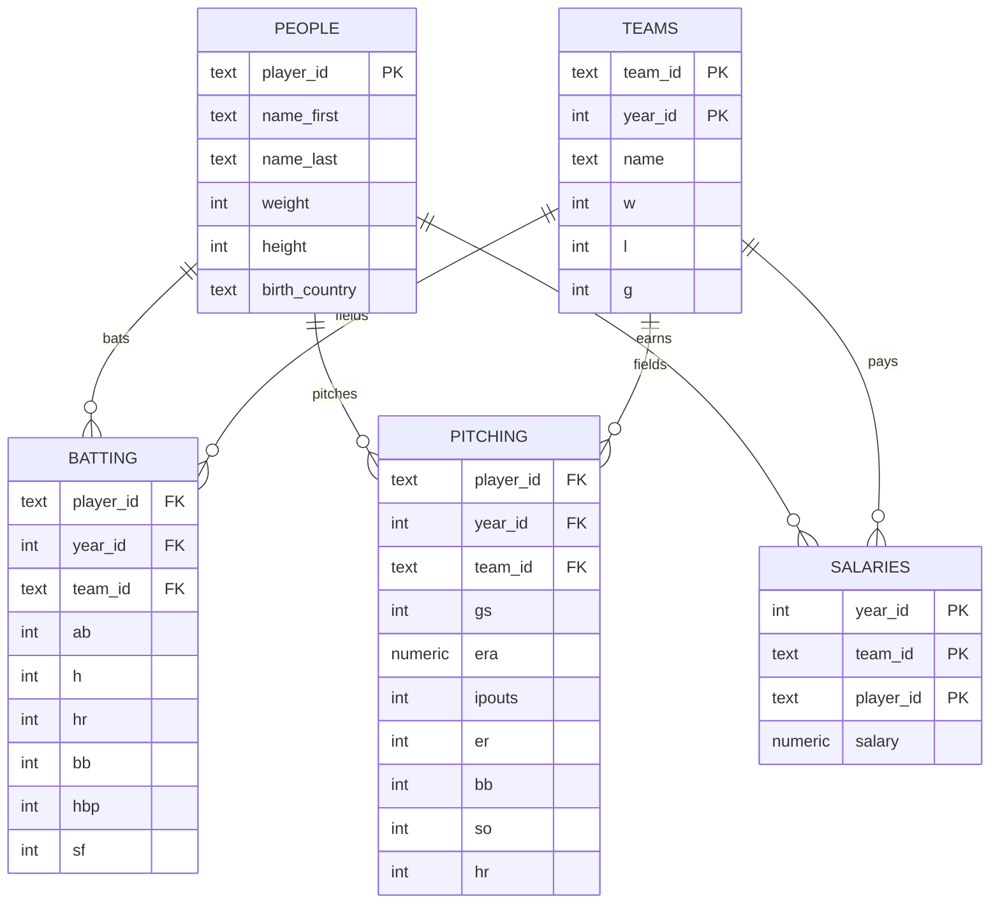

# Baseball Analytics Database

[](https://github.com/Mahnoor-Zaffar/Baseball-Analytics-Database/actions/workflows/ci.yml)
[](https://www.postgresql.org/)
[](https://docs.getdbt.com/docs/core/connect-data-platform/postgres-setup)
[](https://fastapi.tiangolo.com/)
[](LICENSE)

A production-shaped PostgreSQL analytics stack on top of the **Lahman Baseball Database (1871–2019)**. Six historical "awards" derived from physical, financial, and performance dimensions of the data — plus a full sabermetrics layer (FIP, wOBA, era-adjusted ERA, simplified WAR), pgTAP-flavored tests, a dbt DAG, a FastAPI service, and a Jupyter analysis notebook. Everything is reproducible from a clean machine in three commands.

> **TL;DR** — clone, `make up && make load && make migrate && make awards`, and you have a tuned 5-table baseball warehouse with materialized views, advanced metrics, archived `EXPLAIN` plans, and a JSON API in under five minutes.

---

## Why this project

The PRD asked for six SQL "awards" over the Lahman dataset. A junior implementation is a single `.sql` file. A senior implementation treats the same problem as a *small data warehouse* and ships:

- **Reproducibility** — Docker + Makefile + numbered migrations so anyone can run it.
- **Performance discipline** — every query carries `EXPLAIN (ANALYZE, BUFFERS, VERBOSE)`, every join is index-friendly, and plans are archived as CI artifacts so regressions are visible in PR diffs.
- **Analytical depth** — the awards are the *appetizer*. The sabermetrics views (FIP, wOBA, ERA+, WAR proxy) demonstrate domain literacy.
- **Trustability** — data-quality assertions + golden-output regression tests catch silent breakage before it ships.
- **Three consumers** — the same warehouse powers raw SQL scripts, a dbt staging→marts DAG, a JSON API, and a notebook. Proves the schema is general-purpose, not just a query playground.

---

## Quickstart

```bash
cp .env.example .env
make up           # boot Postgres 16 with analytics-tuned config
make load         # download Lahman CSVs + load all raw tables
make migrate      # apply indexes, generated columns, materialized views
make awards       # run the 6 historical awards with EXPLAIN (ANALYZE, BUFFERS)
make sabermetrics # FIP / wOBA / era-adjusted ERA / WAR proxy
make test         # SQL assertion suite + invariants
make dq           # data-quality report (PASS/WARN/FAIL ledger)
make bench        # cold + warm cache benchmark
make dbt          # run + test dbt staging and mart models
make api          # boot the FastAPI service → http://localhost:8000/docs
make notebook     # boot Jupyter → http://localhost:8888
```

Stop everything: `make down`. Nuke the volume: `make clean`. Run the whole pipeline end-to-end: `make all`.

---

## Architecture



## Schema (high level)



---

## Repository layout

```
.
├── README.md · LICENSE · PRD.md · Makefile · docker-compose.yml
├── .github/workflows/ci.yml         End-to-end CI (lint → load → migrate → test → dbt parse)
├── docker/postgres/
│   ├── Dockerfile                   Postgres 16 with pg_stat_statements
│   ├── postgresql.conf              OLAP-tuned: work_mem, parallel workers, JIT
│   └── init/00_extensions.sql       pg_trgm · btree_gin · pgcrypto · schemas
├── migrations/
│   ├── V001__base_schema_notes.sql  Sentinel + migrations ledger
│   ├── V002__performance_indexes.sql Composite + partial indexes for hot paths
│   ├── V003__generated_columns.sql  innings_pitched · OBP · SLG · OPS · K/9 · BB/9
│   └── V004__materialized_views.sql mv_team_payroll · mv_team_physiques · mv_league_pitching_baseline
├── sql/
│   ├── baseball_awards.sql          6 awards w/ EXPLAIN (ANALYZE, BUFFERS, VERBOSE)
│   ├── data_quality.sql             21-check DQ ledger with PASS/WARN/FAIL
│   ├── benchmarks.sql               Cold + warm cache pass, pg_stat_statements top-15
│   └── sabermetrics/
│       ├── fip.sql                  FIP with per-year cFIP constant
│       ├── woba.sql                 wOBA with FanGraphs coefficients
│       ├── era_adjusted.sql         ERA z-score + ERA+
│       └── war_proxy.sql            Honest WAR proxy (no defensive component)
├── tests/
│   ├── test_awards.sql              pgTAP-flavored assertions per award
│   ├── test_data_quality.sql        Structural invariants (indexes, MVs, RI)
│   └── expected/                    Golden fixtures for regression detection
├── dbt/
│   ├── dbt_project.yml · packages.yml · profiles.yml.example
│   └── models/
│       ├── sources.yml              raw.* + analytics.* declared, freshness-ready
│       ├── staging/{stg_*.sql, schema.yml}   Renamed + typed views
│       └── marts/{mart_*.sql, schema.yml}    Curated tables w/ indexes + tests
├── api/
│   ├── main.py                      FastAPI: /awards/* and /leaderboards/*
│   ├── Dockerfile · requirements.txt
├── notebooks/baseball_awards.ipynb  One chart per award + era-effect trend
├── scripts/
│   ├── download_lahman.sh           Idempotent Chadwick Bureau release fetch
│   ├── load_csvs.sql                UNLOGGED bulk load → ALTER LOGGED → ANALYZE
│   └── wait_for_db.sh
└── .sqlfluff · .env.example · .gitignore · .dockerignore
```

---

## The Six Awards

| # | Award | Definition | Source |
|---|---|---|---|
| 1 | **Heaviest Hitters** | `(team_id, year_id)` with the highest avg roster weight | `mv_team_physiques` |
| 2 | **Shortest Sluggers** | Same shape, ascending on avg roster height | `mv_team_physiques` |
| 3 | **Biggest Spenders** | Largest single-season payroll | `mv_team_payroll` |
| 4 | **Most Bang for the Buck (2010)** | `SUM(salary) / teams.w` for 2010, ascending | `mv_team_payroll ⨝ teams` |
| 5 | **Priciest Starter** | `salary / gs` where `gs >= 10`, triple-key join handles mid-season trades | `pitching ⨝ salaries ⨝ people` |
| 6 | **Canadian Ace** ⭐ | Lowest qualified ERA (≥ 54 IP) for TOR or MON | `pitching`, ranked + z-scored |

Run `make awards` to populate exact winners. The notebook (`notebooks/baseball_awards.ipynb`) renders one chart per award plus a bonus *league-average ERA over time* plot that demonstrates why era-adjustment matters.

---

## Engineering choices worth calling out

1. **Top-N over MAX subqueries.** Every award uses `ORDER BY metric LIMIT 1` so PostgreSQL terminates as a Top-N heap (`O(N log k)`) instead of full hash-aggregate + scan.
2. **Dual-/triple-key joins** on `(team_id, year_id)` and `(player_id, year_id, team_id)` enforce the natural composite indexes — no Cartesian inflation, no SUM double-counting across mid-season trades.
3. **Pre-aggregation in CTEs/MVs** before joining to `teams` keeps the final join 1:1 and avoids the classic *"salary × row-count"* bug.
4. **`EXPLAIN (ANALYZE, BUFFERS, VERBOSE)`** on every query, with plans archived to `plans/` and uploaded as CI artifacts so plan regressions appear in PR diffs.
5. **Partial indexes** for the access patterns that *actually* matter: `idx_salaries_2010`, `idx_pitching_era_qualified WHERE era IS NOT NULL AND ipouts >= 162`, `idx_pitching_gs_threshold INCLUDE (...) WHERE gs >= 10`. Massively smaller than full indexes — they fit in `shared_buffers`.
6. **Generated columns** (`innings_pitched`, `obp`, `slg`, `ops`, `k_per_9`, `bb_per_9`) so derived stats are computed once at load, never recomputed at query time.
7. **Materialized views** for the team-roster physiques join, the team-season payroll aggregate, and the per-league pitching baseline. Indexed, refreshable concurrently, used by both raw SQL and dbt marts.
8. **Era-adjusted metrics**, not raw ERA — a 2.50 ERA in 1968 ≠ 2.50 ERA in 2000. `v_era_adjusted` z-scores against `mv_league_pitching_baseline` and surfaces ERA+ (Baseball-Reference style).
9. **Postgres tuned for OLAP**: `work_mem=64MB`, `effective_cache_size=1GB`, `max_parallel_workers_per_gather=4`, `jit=on`, `pg_stat_statements` enabled — see [`docker/postgres/postgresql.conf`](docker/postgres/postgresql.conf).
10. **Versioned, idempotent migrations** with a ledger table — re-running `make migrate` is safe; out-of-order migrations are detectable.

---

## API surface (read-only)

Once `make api` is running, open <http://localhost:8000/docs> for the auto-generated Swagger UI. Endpoints:

| Method | Path | Description |
|---|---|---|
| GET | `/health` | Liveness probe |
| GET | `/awards/heaviest-hitters` | Award 1 |
| GET | `/awards/shortest-sluggers` | Award 2 |
| GET | `/awards/biggest-spenders?year=` | Award 3 (year optional) |
| GET | `/awards/bang-for-buck?year=2010` | Award 4 (any year) |
| GET | `/awards/priciest-starter?year=` | Award 5 (year optional) |
| GET | `/awards/canadian-ace?min_ipouts=162` | Award 6 (configurable IP floor) |
| GET | `/leaderboards/fip?limit=10` | Lowest FIP all-time |
| GET | `/leaderboards/woba?limit=10` | Highest wOBA all-time |
| GET | `/leaderboards/era-plus?limit=10` | Highest ERA+ all-time |

Parameter binding is used everywhere — no string interpolation, injection-safe by construction.

---

## Continuous integration

Every push runs the [`ci.yml`](.github/workflows/ci.yml) workflow:

1. **Lint** — `sqlfluff` over all SQL, `ruff` over the FastAPI service.
2. **End-to-end** — boots a fresh Postgres 16 service container, downloads Lahman, loads CSVs, applies migrations, runs the sabermetrics views, executes the assertion suite, and uploads the archived `EXPLAIN` plans as an artifact.
3. **dbt parse** — validates the dbt project compiles and resolves cleanly against the seeded schema.

Job summary on every run includes the top award winners so reviewers can see results without leaving the PR.

---

## What I'd build next

- **Park factors and league/era normalization** for offensive metrics (Coors Field, dead-ball era).
- **Partitioning** `batting` and `pitching` by `year_id` once the dataset crosses ~50M rows.
- **Incremental dbt models** + dbt snapshots once a streaming Lahman successor (Baseball Reference, Statcast) is wired in.
- **GraphQL** facade over the FastAPI service for flexible award lookups + nested player/team graphs.
- **Streamlit dashboard** consuming the FastAPI endpoints for a public-facing demo.
- **OpenTelemetry** in the API layer with traces correlated to `pg_stat_statements` queryid.

---

## Stack at a glance

| Layer | Tech |
|---|---|
| Database | PostgreSQL 16 (Docker, OLAP-tuned `postgresql.conf`) |
| Schema migrations | Numbered idempotent `.sql` files + ledger table |
| Transformations | Native SQL + dbt-postgres 1.8 (staging → marts) |
| API | FastAPI 0.115 + psycopg 3 + connection pool |
| Notebook | Jupyter (scipy-notebook) + pandas + seaborn |
| Tests | psql `DO $$ … $$` assertions + dbt schema tests |
| Lint | `sqlfluff` (SQL) · `ruff` (Python) |
| CI | GitHub Actions: lint + e2e + dbt parse, plans uploaded as artifact |

---

## License

[MIT](LICENSE). Lahman data © [Sean Lahman](https://www.seanlahman.com/baseball-archive/statistics/) under CC-BY-SA 3.0, distributed via [Chadwick Bureau's `baseballdatabank`](https://github.com/chadwickbureau/baseballdatabank).
