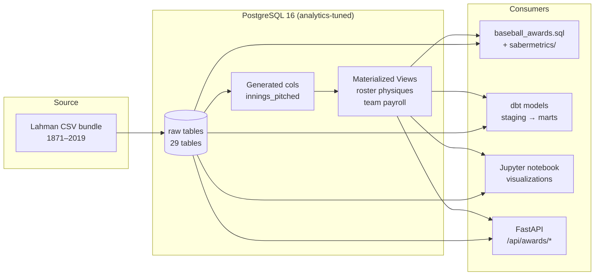
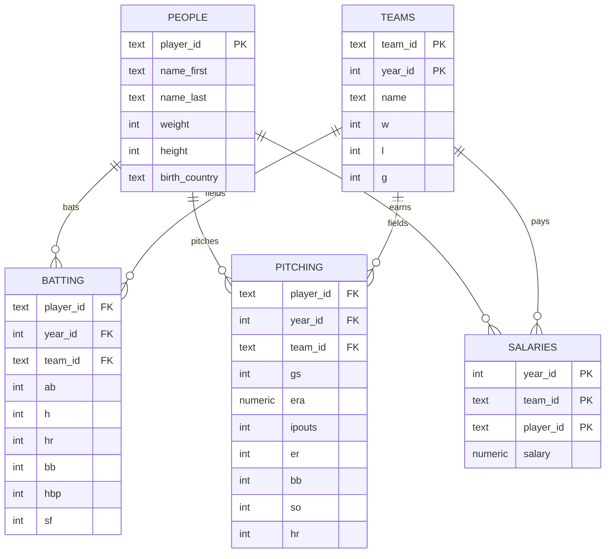

# Baseball Analytics Database

A reproducible, containerized PostgreSQL analytics stack on top of the Lahman Baseball Database (1871–2019). Six historical "awards" plus a full sabermetrics layer (FIP, wOBA, era-adjusted ERA, simple WAR proxy), data-quality assertions, dbt models, a FastAPI read-only service, and a Jupyter analysis notebook — all driven by a single `make` target.

> One command (`make up && make load && make awards`) takes a clean machine to a fully populated 29-table baseball warehouse with materialized views, advanced metrics, and an EXPLAIN-plan archive in under five minutes.

---

## Quickstart

```bash
cp .env.example .env
make up           # boot Postgres 16 with analytics-tuned config
make load         # download Lahman CSVs and load all 29 tables
make migrate      # apply indexes, generated columns, materialized views
make awards       # run the 6 historical awards
make sabermetrics # FIP / wOBA / era-adjusted ERA / WAR proxy
make test         # SQL assertion suite (pgTAP-style)
make dq           # data-quality report across all 29 tables
make bench        # cold + warm cache benchmark with EXPLAIN BUFFERS
make dbt          # run + test dbt staging and mart models
make api          # boot the FastAPI service at localhost:8000
make notebook     # boot the Jupyter notebook at localhost:8888
```

Stop everything: `make down`. Nuke the volume: `make clean`.

---

## Architecture



## Schema (high level)



---

## What's in here

| Path | Purpose |
|---|---|
| `sql/baseball_awards.sql` | The six historical awards (PRD §2–5) with `EXPLAIN (ANALYZE, BUFFERS, FORMAT JSON)` |
| `sql/sabermetrics/` | FIP, wOBA, era-adjusted ERA, WAR proxy — proper sabermetric layer |
| `sql/data_quality.sql` | Orphan rows, NULL ratios, referential audits across all 29 tables |
| `sql/benchmarks.sql` | Cold/warm-cache timing harness using `pg_stat_statements` |
| `migrations/` | Versioned schema changes (indexes, generated cols, materialized views) |
| `tests/` | SQL assertions + golden output fixtures for regression detection |
| `dbt/` | `staging` → `marts` DAG with `schema.yml` tests |
| `api/` | FastAPI read-only service exposing every award as a JSON endpoint |
| `notebooks/` | Jupyter notebook that runs the queries and plots them |
| `scripts/` | Lahman CSV download + COPY-based loader |
| `docker/postgres/` | Hardened Postgres image with `postgresql.conf` tuned for analytics |
| `.github/workflows/ci.yml` | End-to-end CI: spin up Postgres, load data, run tests, post plans |

---

## Results

Run `make awards` to populate this table. Sample format:

| Award | Winner | Year | Metric |
|---|---|---|---|
| Heaviest Hitters | _populated by query_ | _yyyy_ | _avg lbs_ |
| Shortest Sluggers | _populated by query_ | _yyyy_ | _avg in_ |
| Biggest Spenders | _populated by query_ | _yyyy_ | _total payroll_ |
| Most Bang for the Buck (2010) | _populated by query_ | 2010 | _$ / win_ |
| Priciest Starter | _populated by query_ | _yyyy_ | _$ / start_ |
| Canadian Ace | _populated by query_ | _yyyy_ | _ERA_ |

The notebook (`notebooks/baseball_awards.ipynb`) renders one chart per award.

---

## Engineering choices worth calling out

1. **Top-N over MAX subqueries.** Every award uses `ORDER BY metric LIMIT 1` so PostgreSQL terminates the sort as a Top-N heap (`O(N log k)`) instead of a full hash aggregate followed by another scan.
2. **Dual-key joins** on `(team_id, year_id)` enforce the natural composite indexes on `teams` and `salaries` — no Cartesian inflation, no SUM double-counting.
3. **Pre-aggregation in CTEs** before joining to `teams` keeps the final join 1:1 and prevents the classic "salary multiplied by row count" bug.
4. **`EXPLAIN (ANALYZE, BUFFERS, FORMAT JSON)`** on every query, with plan output archived to `plans/` so plan regressions are visible in PR diffs.
5. **Era-adjusted metrics**, not raw ERA — a 2.50 ERA in 1968 ≠ 2.50 in 2000. The sabermetrics layer z-scores against the league-season mean and standard deviation.
6. **Generated columns** for derived stats (e.g., `innings_pitched = ipouts / 3.0`) so consumers never recompute them.
7. **Materialized views** for the team-roster physiques join and team-season payroll aggregate — refreshed concurrently, indexed, and used by both the awards script and dbt marts.
8. **Postgres tuned for OLAP**: `work_mem=64MB`, `effective_cache_size=1GB`, `max_parallel_workers_per_gather=4`, `pg_stat_statements` enabled — see `docker/postgres/postgresql.conf`.

---

## What I'd do next

- **Park factors and league/era normalization** for offensive metrics (Coors Field, dead-ball era).
- **Partitioning** the larger fact tables (`batting`, `pitching`) by `year_id` once the dataset crosses ~50M rows.
- **Incremental dbt models** with snapshots once a streaming Lahman successor (Baseball Reference, Statcast) is wired in.
- **GraphQL layer** over the FastAPI service for flexible award lookups.
- **Streamlit dashboard** consuming the FastAPI endpoints for a public-facing demo.

---

## License

MIT. Lahman data © [Sean Lahman](https://www.seanlahman.com/baseball-archive/statistics/) under CC-BY-SA 3.0.
